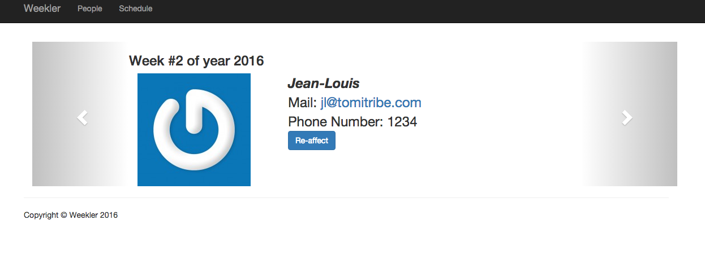

= Weekler

A simple application to manage week affectation in a user list.

== How does it work?

Weekler relies on a user list. Each user has an ordinal. When you show a week
weekler will create the week if not already in the database and in the future (= past week are ignored).
One person of the database will be affected to the week (NOTE: ensure to create at least one person).
To select the person weekler will use the next person in the list browsing people in ascending ordinal order.

== Build

[source]
----
mvn clean package
----

== Run

[source]
----
mvn compile tomee-embedded:run
----

Then go on http://localhost:8080/weekler/

== TODO

=== Build

- probably write a mojo to simplify the frontend part (defaults + auto transpilation of ts)
- use optimized angular2, rxjs versions

=== Tests

- add JAXRS tests
- add frontend tests
